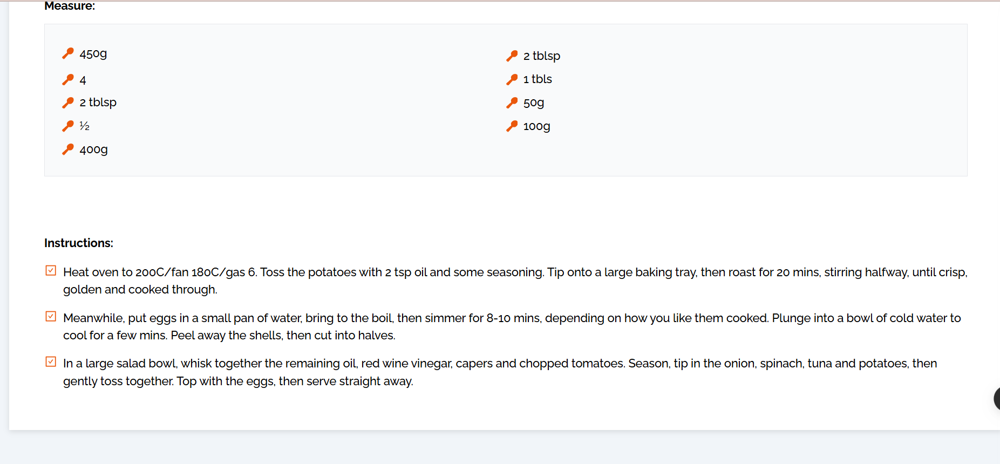

# FastEat

A modern recipe discovery platform featuring:
- Intuitive recipe search with instant results
- Categorized food sections (Beef, Desserts, Sides, etc.)
- Clean, responsive UI with orange accent theme
- Interactive search bar with auto-focus
- Mobile-friendly grid layout for food categories
- Visual category cards with hover effects

Built using HTML5 and Tailwind CSS for a seamless user experience.

## Setup Instructions
1. **Clone the repository**
2. **Install dependencies:**
   ```sh 
   npm install
3. **Run the development server:**
   ```sh 
   npm start

## Home page
  
  


## Category Detail page


## Drawer in home page


## Meal Detail


